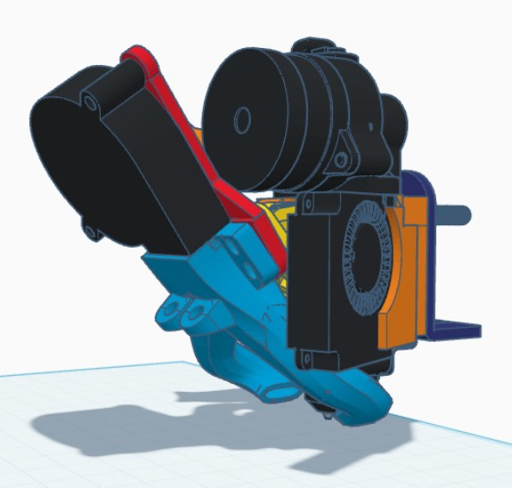
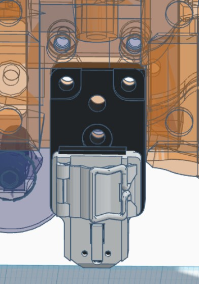
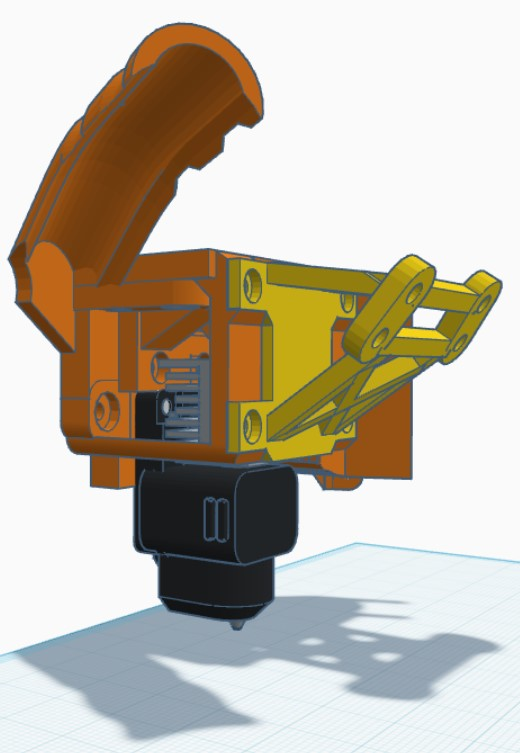

Bambu Lab A1 hotend with Orbiter 2 extruder for Voxelab Aquila (Ender 3 V2 clone)

> [!NOTE]  
> Part cooling duct is not included in files!

## About design

I wanted to use A1 hotend so that nozzle changes would be easier. It is quite easy to pull threads from cheap V6 aluminum heat block or stick volcano nozzle to heat block with little leak.

Though A1 nozzles are quite constant in length, putting them at precisely same height is not as easy. Without Z-offset sensor it is usually necessary to run short one layer test and tune Z-offset.

In the end we got also A1 Mini in the house, where 0.2 mm nozzle is used a lot. It is a lot easier and better printer for 0.2 mm ;)

## Parts

* Orbiter 2 extruder
* Bambu Lab A1 Hotend Heating Assembly (includes mounting screws but no nuts)
* Bambu Lab A1 nozzle
* 3 M3 nuts
* 2 M3 bolts (shorter than original hotend mounting bolts)
* 4010 blower fan
* Part cooling fan and duct

## Printed parts

* Base
    * Use high infill so that base does not "give" under mounting bolt pressure and allow them to loosen
    * PLA+ is good (ordinary PLA should be too) for unenclosed printer as well as PETG. Enclosed printer probably benefits from ABS/ASA or similar temperature resistant filament.
* Cooling duct holder
    * Use magnets in base and holder (5x2 mm)
    * Modify and mount cooling duct of your choice (I used [The Claw](https://www.thingiverse.com/thing:5202213) bent in Blender, but won't share it as I'm not sure about restrictions)
* Clip x 2

## Assembly
* Glue magnets to base and duct holder
* Mount A1 heating assembly to base with included 3 bolts and 3 M3 nuts (they go in pockets at the back).
* Mount Orbiter 2 extruder to base. Use PTFE tube at the bottom. Trim length so it is flush with base.
* Mount base to X carriage with short M3 bolts. Length should be such that the ends stick out a bit from the back (add M3 nuts there if carriage threads are shot like mine).
* Add clips with short M3 bolts and nuts to stabilize mounting.
* Insert 4010 fan. It is easily more efficient and less loud than normal 4010 fans.
* Cabling etc...

## Further notes
Drilling mounting holes directly to X carriage might be simpler, at least it should be stiffer way to mount the heating assembly. Use nuts at back, I woudln't trust threads in 3 mm aluminun ;)
