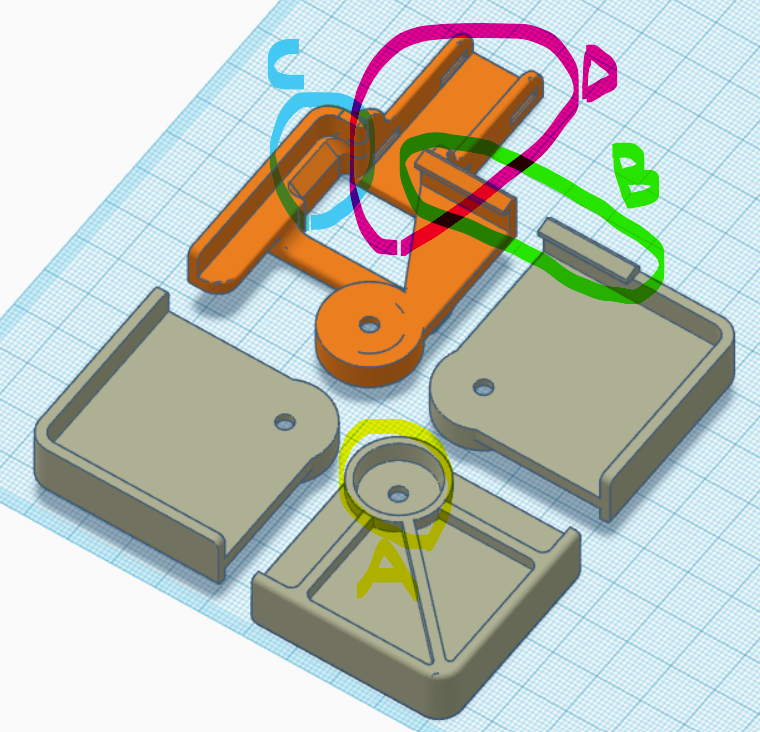

Aquila bed corners

Remix of Ray Bonneau's __Voxelab Aquila glass bed corner supports and heated bed cable\corner support__ https://www.thingiverse.com/thing:4868422

## Modifications:
* A - widened base for 16mm diameter silicon spacers. All are equal 18mm height with 4mm hole.
* B - tab at rear to keep glass down - replaces clips at back. They are maybe a bit too small. FFDM -> print vertically (side of the tab on platform, perimeters create tab).
* C - my bed had wires soldered here, so I had to cut room. This should fit better.
* D - raised cable support closer to bed bottom, it was a bit low

## Assembly
* Print corners:
    * Tough resin recommended.
    * PETG and ABS could work if tabs come out good. Use thin wall width (e.g. o.35mm), many walls (e.g. 4) for rear parts. Experiment first.
    * 2 x front
    * 1 x rear left with cable support and glass tab
    * 1 x rear right with glass tab
* Remove bed levelling nuts and springs.
* Remove original cable support (I didn't get it open so tucked it at the back).
* Insert corners, silicon spacers, bolts and bed levelling nuts.
* Slide glass under tabs and lower front. Put clip or two at front.
* Level.
* Print a lot ;)