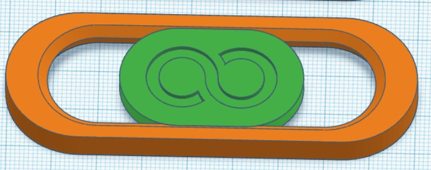
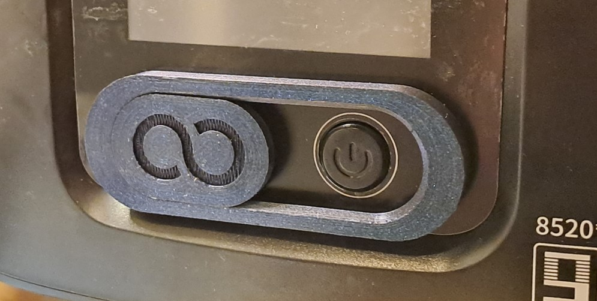

Sliding cover to prevent powering Elegoo Mars 4 with USB stick in it. That may cause machine bootloader to start erasing firmware, even if USB does not have new firmware.

## Well done, Elegoo :/

* Print on flat side (top) against bed (filament printer), or angled with supports (resin).
* File ending -06 has 0.6 mm clearance on both sides. If the slider fuses to body, use file ending -08 with 0.8 mm clearance on both sides. Smear pencil on slides to make the slider move easier.
* Mount with double-sided adhesive, blue tack, white tack or similar.

Design (yes, Tinkercad :) )

In place

