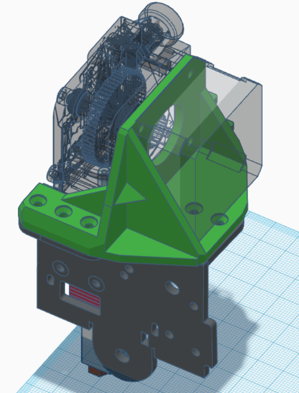
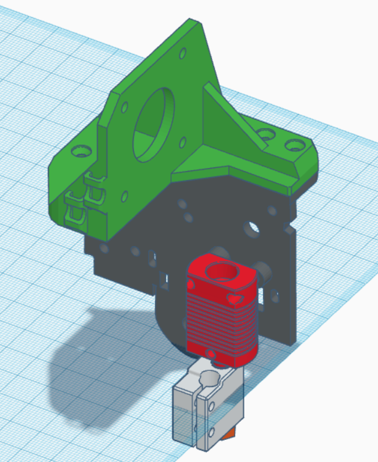

Titan clone (not inverted) mount for _UniTak3D Ender 3 Direct Drive Upgrade Kit Conversion Mount for Ender 3 V2, Ender 3 Pro and Voxelab Aquila 3D Printer Compatible with BMG Dual Drive & Bowden Extruder & Dual Gear Extruder_

Titan cannot be mounted with included mount plate, not sure about reversed.

## Parts:
* Printed mount
* 2 x M3x6 sunken screws, can be longer if they don't hit shroud or levelling sensor
* 3 x M3x12 sunken screws

## Assembly
* Print mount
    * PETG, PLA+, PLA etc
    * many walls, bottoms and tops
    * lay on flat on bottom
* Remove support from stepper motor opening, ream screw holes if necessary
* Screw mount to X plate, two short screws on left
* Mount Titan to mount plate (pancake motor is least weight)
* Tube between hotend and extruder can be a bit fiddly
    * If tube goes all the way to nozzle,
        * remove nozzle and heat block
        * push tube all the way to extruder (it will go a long way inside black guide)
        * cut tube slightly below heatbreak
        * mount heat block and nozzle back, tighten when hot
* Tune retraction (somewhere around 0.8 - 1.0 mm)
* Print a lot ;)