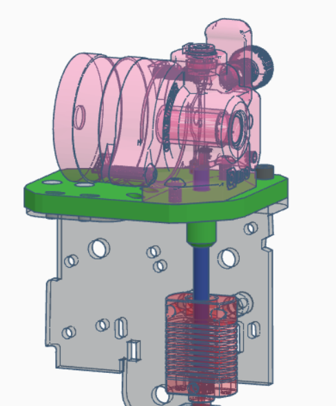
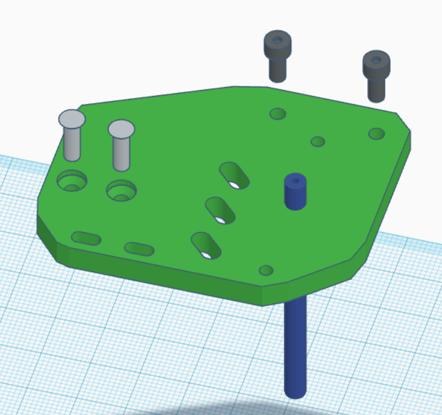
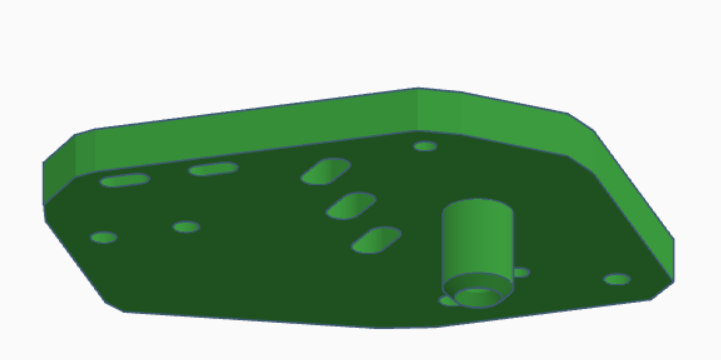

Orbiter 2.0 extruder mount for _UniTak3D Ender 3 Direct Drive Upgrade Kit Conversion Mount for Ender 3 V2, Ender 3 Pro and Voxelab Aquila 3D Printer Compatible with BMG Dual Drive & Bowden Extruder & Dual Gear Extruder_

## Parts:
* Printed mount
* 2 x M3x8 sunken screws, can be longer if they don't hit shroud or levelling sensor
* 2 x M3x10 button or head screws, not long enough to touch the wheel
* 2 x M3x10 or 3x10 mm button head plastic screws, rear one must not stick through the mount plate!
* PTFE tube

## Assembly
* Print mount
    * PETG, PLA+, PLA etc
    * many walls, bottoms and tops
    * lay on flat on top
* Push PTFE tube through mount (drill hole if necessary) and to the hotend
* Trimm PTFE with Orbiter, it needs to be snug but not compressed in length
* Optional: chamfer top inside of PTFE tube with drill, lexan reamer or hobby knife (make sure no shavings end up in the tube, push it clean with piece of filament)
* Screw mount to X plate, sunken screws on left
* Mount Orbiter on top of mount plate with last screws
* Tune retraction (Volcano with Linear Advance K 0.08 it should be somewhere around 0.5 mm)
* Print a lot ;)