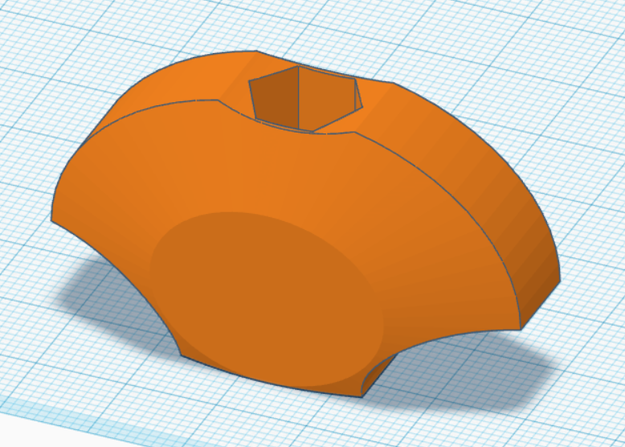
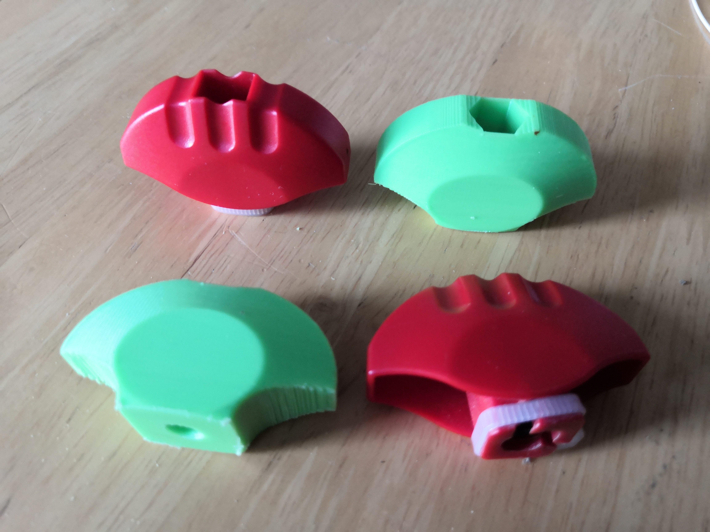
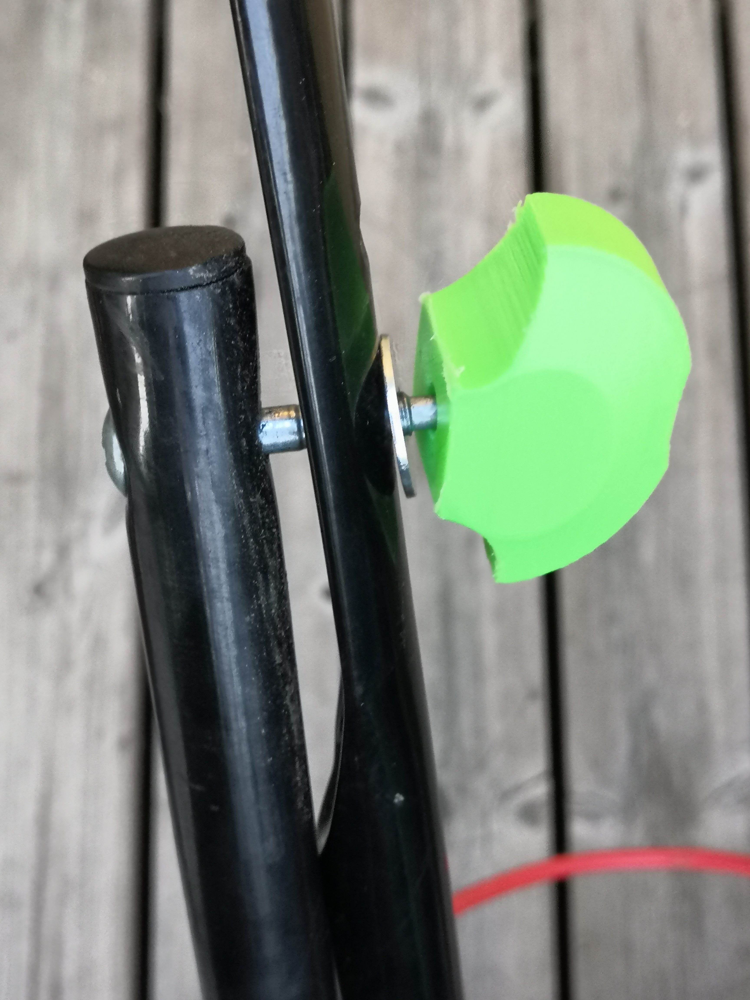
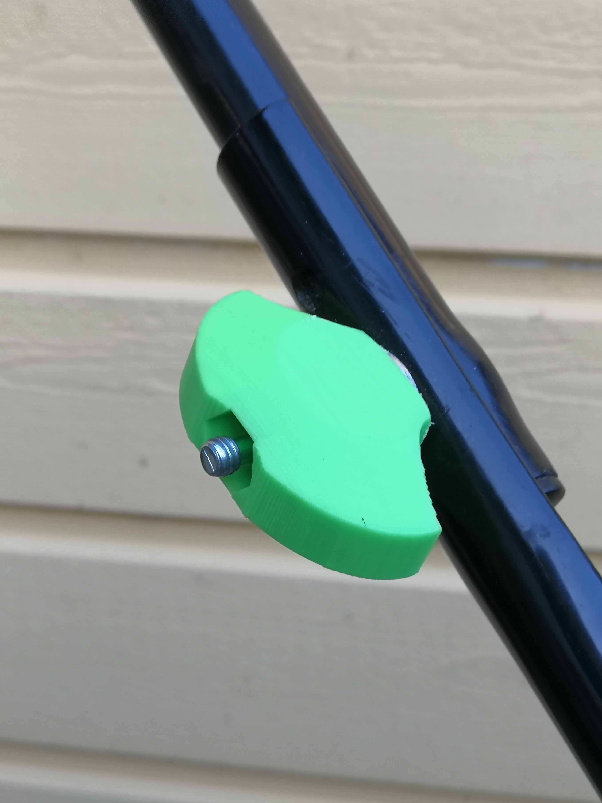

Handlebar wing nut for Bosch Rotak 32 electric lawn mover.

## Parts
* 2 M6 nuts
* 2 M6 washers (optional)
* M6 bolt (for assembly)

## Printed parts

* 2 wing nuts.
    * Make them strong ;)
    * PLA+ is good (ordinary PLA should be too) for colder climate (and not left in sun). PETG or ABS might be better for hot climates.
    * I used 5 perimeters, 7 bottom layers and 70% cubic fill with 0.8mm infill line width (the rest with default line width)

## Assembly
* Open bolt hole at the bottom.
* Using M6 bolt, pull M6 nuts to wing nuts.
* Remove original wing nuts, there is thread at the end of bolt to be undone.
* Screw new wing nuts in, washer first if you want to use them.

Comparison between old and printed wing nuts

Wing nut between threads (loose but not lost)

Wing nut tightened
